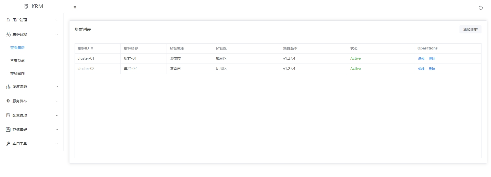

# Vue 3 + Vite

This template should help get you started developing with Vue 3 in Vite. The template uses Vue 3 `<script setup>` SFCs, check out the [script setup docs](https://v3.vuejs.org/api/sfc-script-setup.html#sfc-script-setup) to learn more.

## 基本组件安装
```shell
npm install vite@latest
npm install axios@latest
npm install vue-router@latest
npm install element-plus --save
npm install @element-plus/icons-vue
npm install -D less
```

## 平台样式


## 构建部署
* 开发
```shell
npm install
npm run dev
```
* 生产
```shell
npm install
npm run build
```
## 其他
* 环境变量
vite.config.js:
defineConfig.enDir
* 跨域
vite.config.js:
defineConfig.server

api地址与前端地址相同, 使用server.proxy转发到实际后端地址